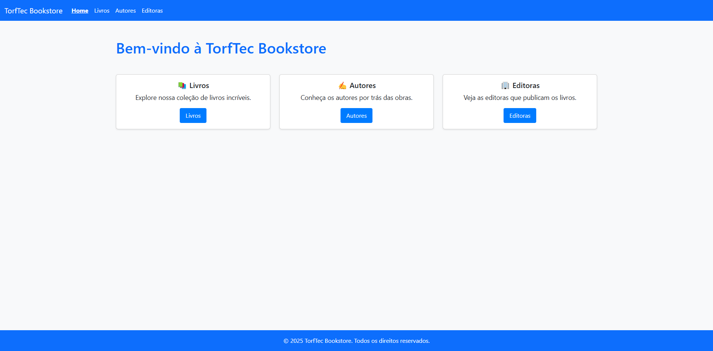
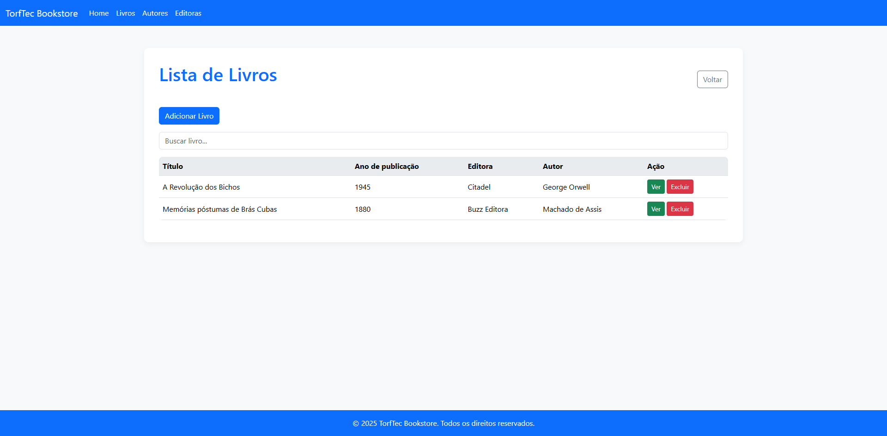
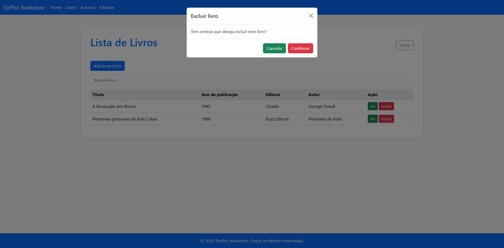
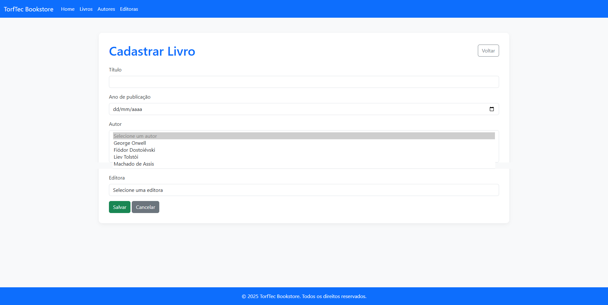
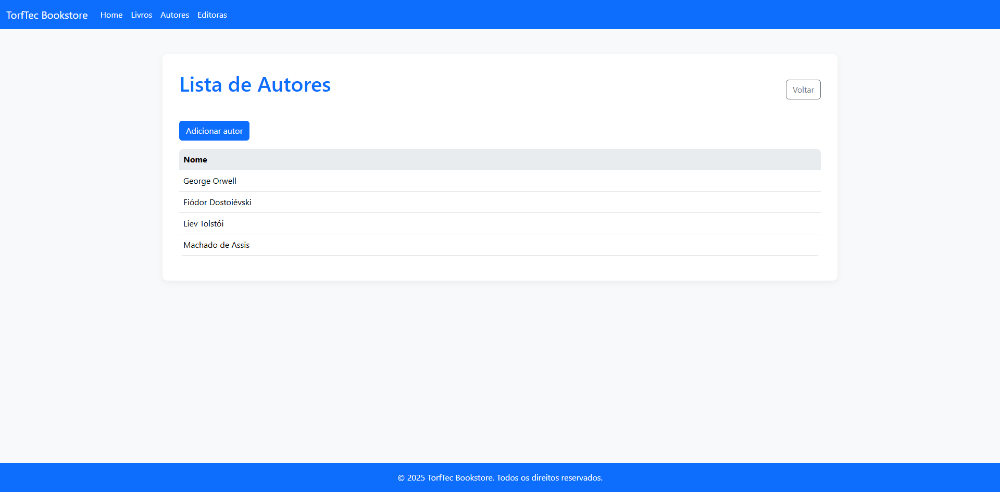
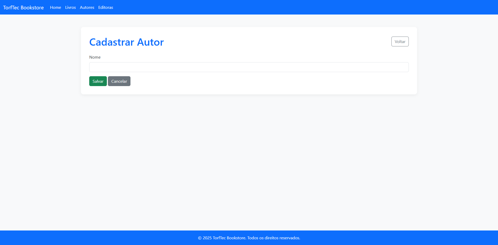
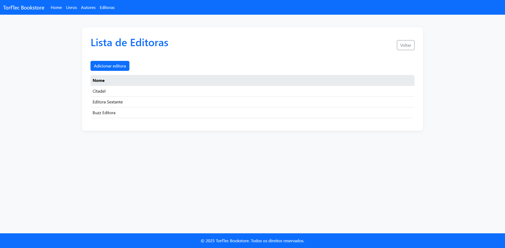
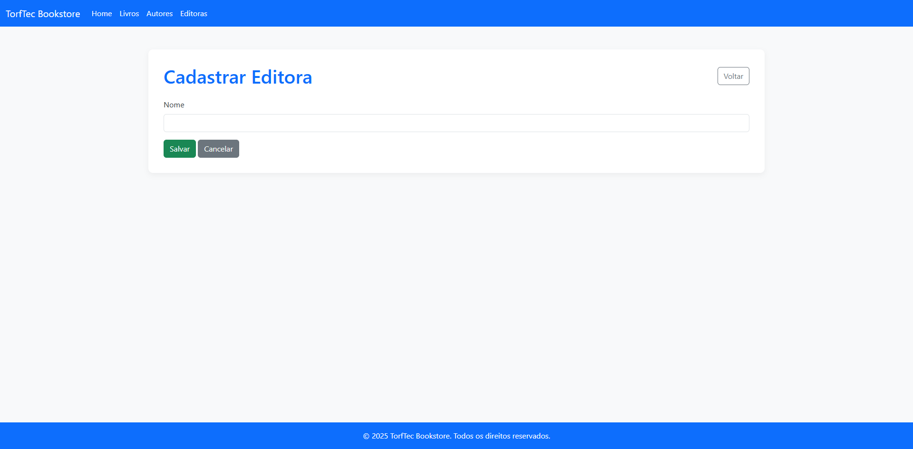

# TorfTec Bookstore ⭐⭐⭐

Este projeto frontend faz parte da disciplina **Desenvolvimento Full Stack Básico**

---

## Como executar ⭐

Basta fazer o download do projeto e abrir o arquivo `index.html` no seu browser.

---

### 1️⃣ Tela Inicial - Home  
📌 **Objetivo:** Apresenta as funcionalidades da aplicação.  

---

### 2️⃣ Tela de Listagem de Livros  
📌 **Objetivo:** Exibir os livros cadastrados e permitir a criação de um novo livro.  

📌 **Elementos:**  
✅ Botão **"Voltar"**  
✅ Botão **"Adicionar Livro"**, **"Ver"**, **"Excluir"**  
✅ Lista de livros cadastrados  
✅ Opção de visualizar o detalhe de um livro  
✅ Opção de excluir um livro  

---

### 2️⃣.1️⃣ Modal para excluir livro  
📌 **Objetivo:** Modal para excluir um livro cadastrado.  

📌 **Elementos:**  
✅ Botão **"Cancelar"**  
✅ Botão **"Confirmar"**  

---

### 3️⃣ Tela de Detalhe do livro  
📌 **Objetivo:** Exibir os dados de um livro específico.  

📌 **Elementos:**  
✅ Botão **"Voltar"**  
✅ Visualização dos dados de um livro, como título, autor(es), ano de publicação, editora  

---

### 4️⃣ Tela de Cadastro de Livro  
📌 **Objetivo:** Formulário para criar um novo livro.  

📌 **Elementos:**  
✅ Botão **"Voltar"**  
✅ Botão **"Salvar"**, **"Cancelar"**  
✅ Campos do formulário: título, ano de publicação, autor(es), editora  

---

### 5️⃣ Tela de Listagem de Autores  
📌 **Objetivo:** Exibir os autores cadastrados e permitir a criação de um novo autor.  

📌 **Elementos:**  
✅ Botão **"Voltar"**  
✅ Botão **"Adicionar autor"**  
✅ Lista de autores cadastrados  

---

### 6️⃣ Tela de Cadastro de Autor  
📌 **Objetivo:** Formulário para criar um novo autor.  

📌 **Elementos:**  
✅ Botão **"Voltar"**  
✅ Botão **"Salvar"**, **"Cancelar"**  
✅ Campos do formulário: nome  

---

### 7️⃣ Tela de Listagem de Editoras  
📌 **Objetivo:** Exibir as editoras cadastradas e permitir a criação de uma nova editora.  

📌 **Elementos:**  
✅ Botão **"Voltar"**  
✅ Botão **"Adicionar editora"**  
✅ Lista de editoras cadastradas  

---

### 8️⃣ Tela de Cadastro de uma Editora  
📌 **Objetivo:** Formulário para criar uma nova editora.  

📌 **Elementos:**  
✅ Botão **"Voltar"**  
✅ Botão **"Salvar"**, **"Cancelar"**  
✅ Campos do formulário: nome  

